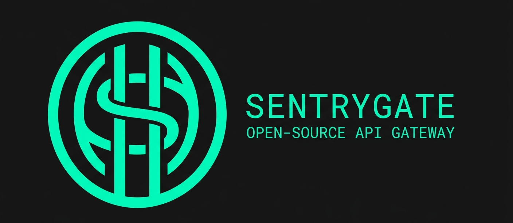

<div align="center">



<br/>
<br/>

> High-performance API gateway built on Bun — routing, auth, and rate limiting with near-zero latency.

[](https://opensource.org/licenses/MIT)
[](https://bun.sh)
[](https://github.com/emekadefirst/SentryGate/releases/tag/Pilot)

</div>

---

## What is SentryGate?

**SentryGate** is a minimalist API gateway built on **Bun**. It acts as a secure front door for your microservices — handling routing, authentication, and rate-limiting — configured entirely through a single `.toml` file.

Built for developers who care about **scale, security, and simplicity**.

---

## Core Pillars

| | |
|---|---|
| **⚡ Performance** | Leverages Bun's ultra-fast runtime and native Fetch API |
| **🛡️ Security** | Auth shielding, header masking, and rate limiting built in |
| **📈 Scale** | Stateless architecture handling thousands of concurrent requests |
| **🛠️ Simplicity** | Your entire infrastructure config lives in one `.toml` file |

---

## Download (Pre-compiled Binaries)

No Bun or Node.js installation required. Grab the standalone binary for your OS:

| Platform | Download |
|:---|:---|
| **Windows (x64)** | [Download `sentrygate.exe`](https://github.com/emekadefirst/SentryGate/releases/download/Pilot/sentrygate.exe) |
| **Linux / macOS** | [Download `sentrygate`](https://github.com/emekadefirst/SentryGate/releases/download/Pilot/sentrygate) |

---

## Quick Start

### 1. Install the command

Run SentryGate globally like `nginx`.

**Linux & macOS**

```bash
# Move binary to your path
sudo mv ~/Downloads/sentrygate /usr/local/bin/sentry

# Make it executable
sudo chmod +x /usr/local/bin/sentry

# Start the gate
sentry start
```

**Windows (PowerShell)**

1. Add its folder to your **System Environment Variables → Path**
2. Open a new terminal and run:

```powershell
sentrygate start
```

---

### 2. Configure your gate

Create `sentrygate.toml` in your project root:

```toml
# Maps to BaseConfig interface
[base]
logging = true
default_rate_limit = true
custom_rate_limit = false

# Maps to ServerConfig interface
[server]
port = 80
name = "SentryGate-Lagos-Instance"
ssl_enabled = false
# cert_path = "/path/to/cert"
# key_path  = "/path/to/key"

# Maps to Record<string, Service>
# "root" prefix → requests hit localhost/users directly
[services.root]
target        = "http://localhost:8000"
strip_prefix  = false
auth_required = false   # set true to enable SentryAuth shield
timeout_ms    = 5000
rate_limit    = 60

# Second service — demonstrates the Record structure
[services.api]
target        = "http://localhost:8000"
strip_prefix  = true
auth_required = true
```

---

## Build from Source

Prefer compiling the TypeScript source yourself?

```bash
# Install dependencies
bun install

# Development mode
bun run src/index.ts

# Compile your own binary
bun build ./src/index.ts --compile --outfile sentrygate
```

---

## Monitoring

SentryGate ships with a built-in health check and status reporter.

```
http://localhost/sentry-status
```

---

## Project Structure

```
src/
├── core/           # Engine and routing
├── middleware/     # Auth, rate limiting, logging
└── utils/          # Config loader, header masking
```

---

## License

MIT © 2026 Victor Chibuogwu Chukwuemeka